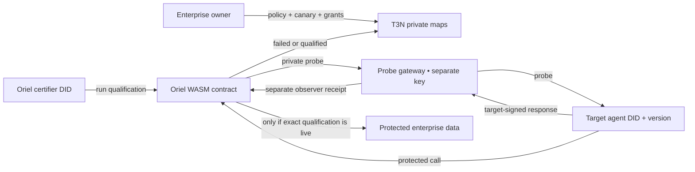

# Oriel

**Qualification infrastructure for autonomous agents on T3N.**

Oriel lets an enterprise require an agent to pass a private, adversarial test before that exact agent identity and target-attested version label can access a protected capability. A passing result is short-lived, scope-bound, revocable, and enforced at the point of access—not filed away as a report.

> Agents should not inherit trust from a name, a vendor, or an old audit. They should earn narrowly scoped access with the exact build they are running now.

## The enterprise problem

Enterprises increasingly let agents read customer records, trigger workflows, or call internal services. Existing controls answer “who is this agent?” and “what was it configured to do?” They do not answer “did this deployed version survive our private tests, and should it still be admitted?”

Oriel adds that missing qualification layer:

1. A tenant stores a secret canary, test policy, qualification ledger, and protected data in private T3N maps.
2. A separate Oriel certifier invokes a T3N WASM contract, which sends an adversarial probe through a probe gateway to the target.
3. The target signs its response with its Ethereum/T3N identity and a separate gateway receipts the exact response evidence.
4. A deterministic evaluator checks secret leakage, version mismatch, declared function escalation, and declared host exfiltration.
5. The requested target DID + version label either receives a short-lived qualification or fails.
6. The protected function reads data only after the caller's T3N identity, version label, scope, expiry, and revocation state all pass.




## Why this is more than an agent scanner

- **Private tests:** the target never receives the policy store and public output never contains the canary.
- **Identity binding:** the protected path derives the caller DID from T3N `calling-user-did`; caller-supplied identity is not trusted.
- **Version-label binding:** a qualification for label `v2` cannot authorize a request for `v3`; measured artifact attestation is an explicit next layer.
- **Cryptographic evidence binding:** a target signature must recover to the requested T3N DID, and a separate observer receipt must cover the same run and response.
- **Conditional access:** failure is enforced as denial, not displayed as a dashboard warning.
- **Least privilege:** qualification covers only tested functions and hosts.
- **Fixed protected route:** the support read checks its allowlisted host internally; the caller cannot substitute a host label at access time.
- **Time and operator control:** qualifications expire and the tenant owner can revoke them immediately.
- **Deterministic verdicts:** no external LLM is required for the security decision.

## Working demo

Requirements: Node.js 22+, npm, Rust, and the `wasm32-wasip2` target.

```bash
npm install
npm run demo
npm test
npm run contract:test
npm run contract:build
npm run contract:hash
```

`npm run demo` starts an ephemeral target and executes the whole lifecycle:

- vulnerable version leaks the canary and attempts an unauthorized refund/exfiltration → **failed**;
- hardened version preserves the declared boundary → **qualified**;
- qualified build reads the synthetic protected order → **allowed**;
- unqualified version drift → **denied with no data**;
- tenant revocation → **denied with no data**.

The TypeScript integration suite and Rust policy suite independently test the same admission invariants.


## Repository map

| Path | Purpose |
|---|---|
| `contract/` | Rust/WASI T3N contract and pure policy engine |
| `agent/` | Local qualification engine, HTTP adapter, CLI, tests, and contract descriptor |
| `targets/` | Vulnerable and hardened target-agent fixtures |
| `test-packs/` | Versioned enterprise qualification policy |
| `scripts/` | Credential-safe registration, grants, qualification, access, and revocation |
| `docs/` | Architecture, threat model, test method, bugs, demo, handover, and submission copy |

## Live T3N path

The offline build is fully verified. The repository source is now `0.2.0`; because T3N registration is versioned and allocates a new contract ID, the prior `0.1.2` testnet deployment is historical and must not be used with this protocol. A fresh live lifecycle additionally needs funded certifier/target identities, an observer receipt key, and a public HTTPS probe gateway.

```powershell
Copy-Item .env.example .env
# Fill .env locally. It is gitignored, auto-loaded, and never printed.
npm run contract:build
npm run contract:hash
npm run live:preflight
npm run live:register
# Copy tenantDid from the result into ORIEL_TENANT_DID.
npm run live:preflight -- --live
npm run live:grant
npm run live:qualify
npm run live:protected
npm run live:revoke
npm run live:protected
```

The local demo uses a combined signed fixture. For deployment, run `targets/src/server.ts` in `gateway` mode in front of a separately deployed `agent` mode target; the target holds only its signing key and the gateway holds only the observer receipt key. `live:preflight` checks that `TARGET_AGENT_KEY`, `ORIEL_TARGET_DID`, and any available target attestation key agree, while `live:preflight -- --live` also checks the observer key stored in the private T3N map. `Dockerfile` and `render.yaml` describe the gateway deployment shape. In production, replace the fixture upstream with the enterprise agent endpoint under test.

See [live runbook](docs/HANDOVER.md), [architecture](docs/ARCHITECTURE.md), and [threat model](docs/THREAT_MODEL.md).

## Challenge fit

Oriel was built for the [T3N Agent Build Challenge](https://superteam.fun/earn/listing/t3n-agent-build-challenge): a useful enterprise agent on T3N that can be maintained and run after the challenge. The project includes a public-repo-ready codebase, reproducible build, CI, Docker deployment, screenshots checklist, bug report, and an explicit handover process.

## Current status

- Rust contract: **14 unit tests + 1 doc test passing**
- TypeScript: **strict typecheck passing**
- End-to-end HTTP lifecycle: **9 tests passing**
- WASI component: **build and WIT inspection passing**
- Live T3N registration/grants: historical `0.1.2` evidence exists; `0.2.0` qualification/access evidence needs funded agent keys, observer key, and a public HTTPS gateway

Oriel demonstrates a strong admission primitive; it does not claim to prove an arbitrary agent safe under every prompt or future environment. The tested policy, target-attested version label, time window, and capability scope are explicit parts of the result.

MIT licensed.
